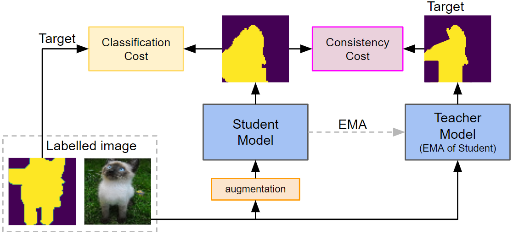
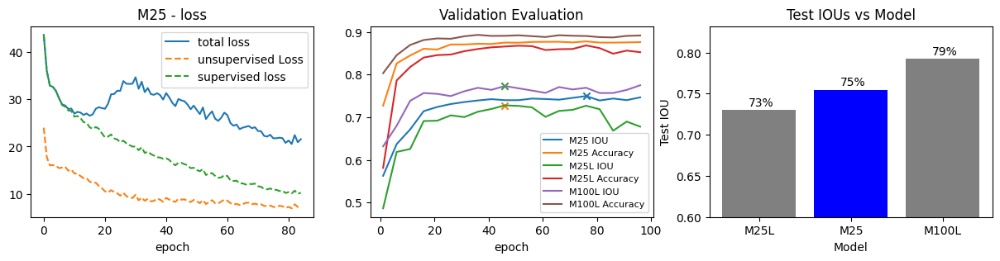
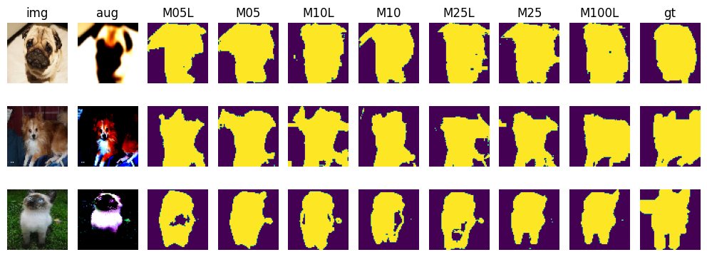

# Mean Teacher: Semi-Supervised Learning

## Project Description

UCL Module Project: Applied Deep Learning (COMP0197)

Date: April 2023

Examining the performance of the semi-supervised learning algorithm, Mean Teacher, for image semantic segmentation task on the Oxford Pet III dataset, through two experiments. 

See [Tarvainen 2018](https://arxiv.org/abs/1703.01780) for more details. A simple visual of the setup is below:



- Experiment 1: A model was trained on 25% labelled and 75% unlabelled data using Mean Teacher, with an aim to study (i) how its performance improves with more (epochs) training and (ii) how its performance compares to supervised only training models.



- Experiment 2: Two additional models were trained on 5%/95% and 10%/90% labelled/unlabelled splits, using Mean Teacher, with the objective to understand how reducing the number of labelled data in Mean Teacher models, affects their performance. Comparative performance of all the models trained is shown below:




## Setup

### Setting up a virtual environment
First, clone the repository:

```bash
git clone https://github.com/fclarke1/ssl-mean-teacher-comp0197
```

Change your directory to the cloned files:

```bash
cd ssl-mean-teacher-comp0197
```

Create a virtual environment with Python 3.10:

```bash
conda create -n ssl-env -c pytorch python=3.10 pytorch=1.13 torchvision=0.14
```

Activate the virtual environment.

```bash
conda activate ssl-env
```

Now you're ready to run the code
    
## Use the code

### Data

The dataset used in this paper is The Oxford Pet III dataset. It contains a collection of 7,365 images of cats and dogs and their labels. There are image-level labels, specifying what animal (i.e. dog or cat) and breed is shown, and pixel-level
labels, providing a semantic segmentation, referred to as "ground truth mask", of the input images. Click [here](https://www.robots.ox.ac.uk/~vgg/data/pets/) to see the data.

### Train / Evaluation

```bash
python main_pt.py [--help] [--train_labelled_pct TRAIN_LABELLED_PCT] [--train_100pct_model] [--evaluate]
```
with

`train_labelled_pct`
Optional argument. Used to train 2 models. Percent of data to be labelled for training. eg. =0.25 will train models M25L (only trained on 25% of data, all labelled) and M25 (using all data, with only 25% labelled)

`train_100pct_model` Optional argument. Used to train M100L model, using 100% of the available data all labelled

`evaluate` Optional argument. Used to evaluate all models (by default evaluates models with 5%, 10%, 25% and 100% labelled data split. To evaluate other bespoke models evaluate.py needs to be edited

#### Example Training
to train M25L, M25 and M100L models
```bash
python main_pt.py --train_labelled_pct 0.25 --train_100pct_model
```

## Authors

- [@fclarke1](https://github.com/fclarke1)
- [@ezermoysis1](https://github.com/ezermoysis1)
- [@martaemili](https://github.com/martaemili)
- [@ruhayat](https://github.com/ruhayat)
- [@MaximilianPowers](https://github.com/MaximilianPowers)
- [@Zythume](https://github.com/Zythume)
- [@GiomariaM](https://github.com/GiomariaM)


## Documentation
[fclarke1's report](https://github.com/fclarke1/ssl-mean-teacher-comp0197/blob/main/report_cw2_22197823.pdf)
